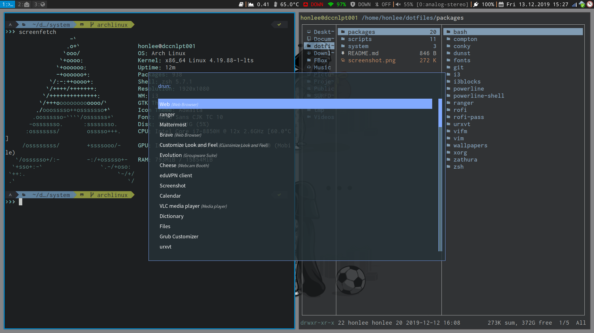

# A repository for personal dotfiles on Linux



## Usage

Checkout the repository, e.g

```bash
$ git clone https://github.com/hurngchunlee/dotfiles.git
```

Packages in the [packages](packages) directory can be applied by using the [GUN stow](https://www.gnu.org/software/stow/) utility.

For instance, one can do

```bash
$ cd dotfiles/packages
$ stow -t $HOME i3
```

In the [scripts](scripts) directory, various shell scripts are provided to install used packages such as

- [oh-my-zsh](https://ohmyz.sh)
- [p10k](https://github.com/romkatv/powerlevel10k)
- [i3-gaps](https://github.com/Airblader/i3)
- [i3blocks](https://github.com/vivien/i3blocks)
- [ranger](https://ranger.github.io)
- [zathura](https://github.com/pwmt/zathura)
- etc.
